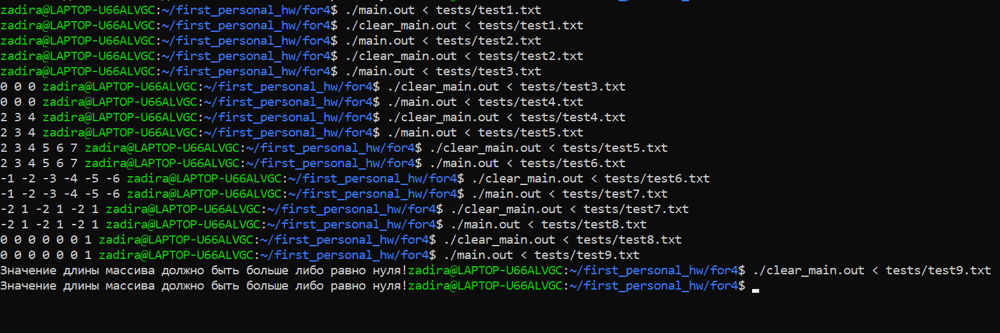
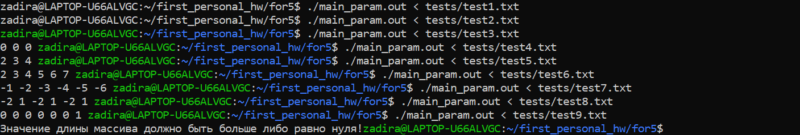

# Отчет ИДЗ 1

## Парахин Николай Викторович

## БПИ 212

&nbsp;

### Вариант 12

__Условие:__
Сформировать массив B из элементов массива A, исключив первый
положительный и последний отрицательный элементы.

Код задачи хранится в папках for, где последние символы отвечают на вопрос, на какю оценку написан этот код.

## На 4 балла

Мною была написана программа на С:

### main.c

``` C
#include "stdio.h"

// изначальный массив
int a[65536];
// конечный массив
int b[65536];
// глобальные переменные int
int ind, n;
int ind_of_first_positive = -1;
int ind_of_last_negative = -1;
int c = 0;

int main(int argc, char** argv) {
    // ввод длины массива
    scanf("%d", &n);
    // если длина меньше 0, код завершает выполнение
    if (n < 0) {
        printf("Значение длины массива должно быть больше либо равно нуля!");
        return 0;
    }
    // считывание элементов первоначального массива
    for (ind = 0; ind < n; ++ind) {
        scanf("%d", &a[ind]);
    }
    // поиск индексов первого положительного и последнего отриц.
    for (ind = 0; ind < n; ++ind) {
        if (a[ind] > 0 && ind_of_first_positive == -1) {
            ind_of_first_positive = ind;
        }
        if (a[ind] < 0) {
            ind_of_last_negative = ind;
        }
    }
    // если элемент под индексом первого полож. или послед. отриц.
    // то он пропускается
    for (ind = 0; ind < n; ++ind) {
        if (ind == ind_of_first_positive || ind == ind_of_last_negative) {
            c++;
        } else {
            b[ind - c] = a[ind];
        }
    }
    // вывод результата из конечного массива
    for (ind = 0; ind < n - c; ++ind) {
        printf("%d ", b[ind]);
    }
    return 0;
```

P.S. : В моем решении задачи учтен тот факт, что массив может состоять полностью из нулей (т.е. из не положительных, ни отрицательных чисел).

1) Использовал команду __gcc -S -O0 main.c__, чтобы создать ассемблерыный файл main.s без оптимизирующих и отладочных операций.
Чтобы не было этих операций, использовал в строке ключ -O0.
2) Использовал команду __gcc -O0 -Wall -masm=intel -S -fno-asynchronous-unwind-tables -fcf-protection=none main.c -o clear_main.s__, чтобы модифицировать программу, убрать макросы.
3) Использовал команды __gcc -O0 main.s -o main.out__ и __gcc -O0 clear_main.s -o clear_main.out__, чтобы создать исполняемые файлы __main.out__ и __clear_main.out__ c флагом -O0.
4) Мною были созданы текстовы файлы-тесты для тестирования программы (for4/tests). Провел тесты на двух программах. Заметно, что результат выполнения эквивалентен:



__Вывод:__ Программы дают одинаковый результат на данных тестах.
Список модификаций: Использовав команду с __-Wall -masm=intel -S -fno-asynchronous-unwind-tables -fcf-protection=none__ ушли макросы .cfi, которые служили для отладночной информации.

Я использовал команду __cat main.s | awk '/^\t./ { print \$ 1 }' | sort | uniq > main_macros.txt__ и __cat clear_main.s | awk '/^\t./ { print \$ 1 }' | sort | uniq > clear_main_macros.txt__, чтобы понять, какие макросы ушли.

__Дополнение:__

Мною были проведены еще ряд махенаций с программой через ключи.
Если использовать команду __gcc -O2 -flto -Wall -masm=intel -S -fno-asynchronous-unwind-tables -fcf-protection=none main.c -o giga_clear_main.s__ то можно избавиться от большинства макросов (__gcc -O2 -flto -Wall -masm=intel -S -fno-asynchronous-unwind-tables -fcf-protection=none main.c -o giga_clear_main.s__).

Описание переменных смотри в main.s в директории for4.

## На 5 баллов

1) Написал программу с функцией make_b, которая принимает в параметры массивы, длину первоначального массива и индексы ненужных элементов, и формирует массив b.

```C
#include "stdio.h"

// функция для создания нового массива b
int make_b(int a[], int b[], int n, int ind_of_first_positive, int ind_of_last_negative) {
    // если элемент под индексом первого полож. или послед. отриц.
    // то он пропускается
    int ind = 0;
    int c = 0;
    for (ind = 0; ind < n; ++ind) {
        if (ind == ind_of_first_positive || ind == ind_of_last_negative) {
            c++;
        } else {
            b[ind - c] = a[ind];
        }
    } 
    return c;
}

int main(int argc, char** argv) {
    // изначальный массив
    int a[65536];
    // конечный массив
    int b[65536];
    // глобальные переменные int
    int ind, n;
    int ind_of_first_positive = -1;
    int ind_of_last_negative = -1;
    int c = 0;
    // ввод длины массива
    scanf("%d", &n);
    // если длина меньше 0, код завершает выполнение
    if (n < 0) {
        printf("Значение длины массива должно быть больше либо равно нуля!");
        return 0;
    }
    // считывание элементов первоначального массива
    for (ind = 0; ind < n; ++ind) {
        scanf("%d", &a[ind]);
    }
    // поиск индексов первого положительного и последнего отриц.
    for (ind = 0; ind < n; ++ind) {
        if (a[ind] > 0 && ind_of_first_positive == -1) {
            ind_of_first_positive = ind;
        }
        if (a[ind] < 0) {
            ind_of_last_negative = ind;
        }
    }
    c = make_b(a, b, n, ind_of_first_positive, ind_of_last_negative);
    // вывод результата из конечного массива
    for (ind = 0; ind < n - c; ++ind) {
        printf("%d ", b[ind]);
    }
    return 0;
}
```

2) Использовал локальные переменные в функции main и в функции make_b.
3) Использовал команду __gcc -O0 -Wall -masm=intel -S -fno-asynchronous-unwind-tables -fcf-protection=none main_param.c -o main_param.s__ чтобы получить ассемблерный код (смотри директорию for5).
4) Провел тестирования:

Видно, что работа программы аналогична работе предыдущих.
5) В файле main_param.s есть описание всех нужных параметров функций и связи их с регистрами.

P.S. В директориях есть папка tests c тестами.
